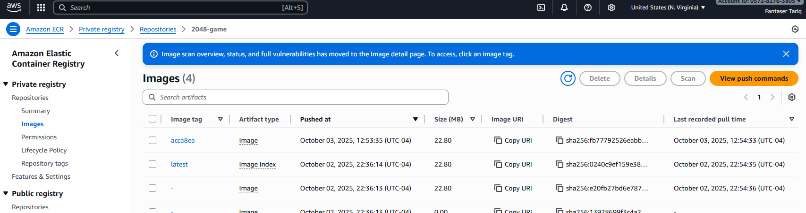
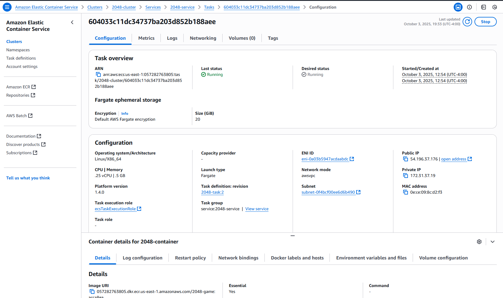
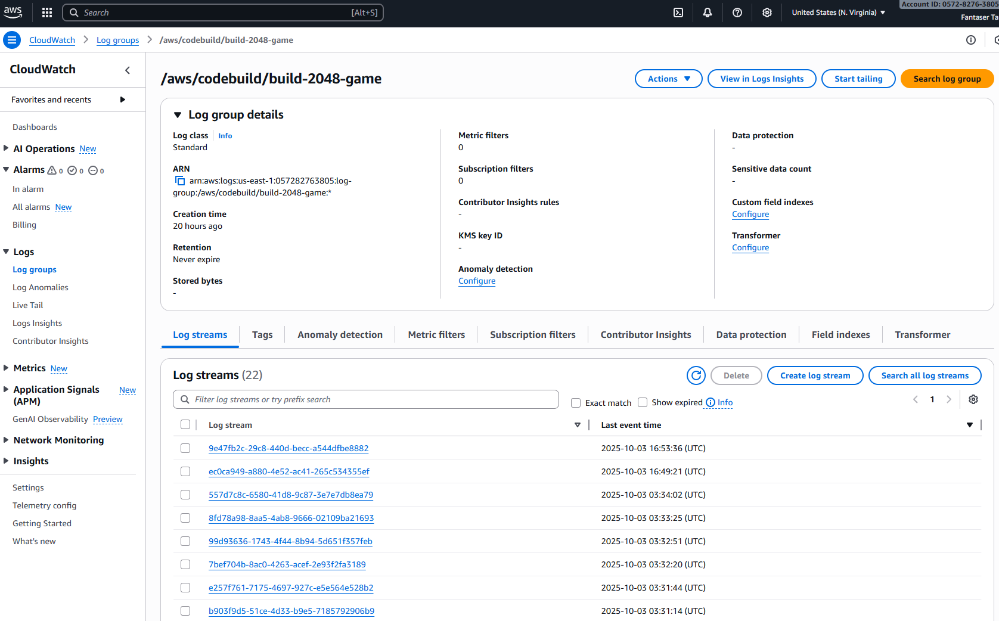

# 🚀 2048 Game — CI/CD Pipeline on AWS

This repository contains a containerized version of the **2048 game**, along with a complete **CI/CD pipeline** built on AWS using GitHub, CodePipeline, CodeBuild, Amazon ECR, and Amazon ECS (Fargate).  
Whenever you push changes to GitHub, the pipeline automatically builds, stores, and deploys the updated container to AWS — giving you a live, always-up-to-date web game.

---

## 📸 Project Screenshots

### 🎮 Live Game


### 🏗️ CI/CD Pipeline Run


### 🐳 Amazon ECR Repository


### 📊 Architecture


### ECS Cluster & Service


### Cloudwatch Logs



## 📁 Repository Structure

.
├── js/ # Game’s JavaScript source files
├── style/ # CSS / SCSS / styling files
├── index.html # Entry point (HTML)
├── Dockerfile # Instructions for building the Docker image
├── buildspec.yml # AWS CodeBuild build instructions
├── meta/CI-CD Pipeline.png # Architecture diagram
└── README.md # Project documentation (this file)


---

## 🏗️ Architecture & Workflow

Here’s how everything fits together:

### 🖼 Architecture Diagram  
(Viewable in this repo at `meta/CI-CD Pipeline.png`)

### 🔄 CI/CD Flow (Step-by-Step)

1. **GitHub (Source Stage):**  
   Developer pushes code changes (HTML, JS, CSS, Dockerfile) to the GitHub repository.  
   AWS CodePipeline is configured to monitor the `main` branch for commits.

2. **CodePipeline (Orchestration):**  
   When a change is detected, the pipeline triggers the **Build** stage.

3. **CodeBuild (Build & Push):**  
   - Runs the commands defined in `buildspec.yml`  
   - **Pre-build:** logs in to Amazon ECR  
   - **Build:** builds a Docker image of the 2048 game  
   - **Post-build:** tags and pushes the image to ECR, and generates `imagedefinitions.json`

4. **Amazon ECR (Container Registry):**  
   Stores and versions the Docker images. ECS uses these images for deployment.

5. **Amazon ECS (Fargate Service):**  
   - ECS pulls the latest image from ECR.  
   - Replaces the old container task with a new one containing the updated code.  
   - Your game is thus redeployed automatically with each commit.

6. **User Access / Networking:**  
   - The ECS task is configured to expose port 80 and allow public access.  
   - Users open the public IP / DNS and play the live 2048 game in a browser.

---

## 🛠 Technologies & Services Used

| Component              | Role / Purpose |
|------------------------|----------------|
| **GitHub**             | Host source code and trigger pipeline |
| **Docker**             | Package 2048 game as a container |
| **AWS CodePipeline**   | Automate the flow from source → build → deploy |
| **AWS CodeBuild**      | Build and push Docker image via `buildspec.yml` |
| **Amazon ECR**         | Private container registry for storing images |
| **Amazon ECS (Fargate)** | Run container as serverless tasks, manage rolling updates |
| **IAM / Permissions**  | Secure access between services (ECR, CodeBuild, ECS) |
| **Networking / VPC**   | Public IP / endpoint configuration |

---

## 🧷 How to Run Locally (for Demo / Testing)

```bash
# Clone this repo
git clone https://github.com/fantasertariq895/2048-game.git
cd 2048-game

# Build Docker image locally
docker build -t 2048-game .

# Run container locally, mapping port 80 to 8080
docker run -p 8080:80 2048-game


---

👉 Would you also like me to **generate a GitHub profile-style README section** (with badges, skill highlights, etc.) so when HR sees your repo they instantly know it’s a professional cloud project?
